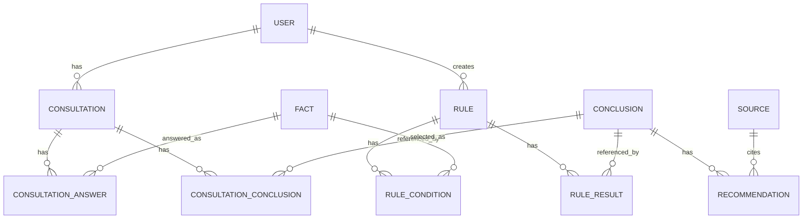

# Database Specification Rekofin API

Dokumen ini adalah spesifikasi database berdasarkan kondisi aktual Prisma schema pada `prisma/schema.prisma`.

## Ringkasan Cepat

- DB Provider: MySQL
- ORM: Prisma
- Total tabel: 11
- Kategori tabel:
  - Master: 6 tabel
  - Konjungsi (junction): 2 tabel
  - Transaksi: 3 tabel

## Daftar Enum

### Role

- ADMIN
- USER

### Gender

- MALE
- FEMALE
- UNKNOWN

### ConsultationStatus

- IN_PROGRESS
- COMPLETED

### SourceType

- BOOK
- WEBSITE
- EXPERT
- JOURNAL
- OTHER

## Klasifikasi Tabel

### 1) Tabel Master

Tabel master menyimpan data referensi utama sistem.

| Tabel          | Fungsi Utama                                             |
| -------------- | -------------------------------------------------------- |
| user           | Menyimpan akun pengguna (admin/user)                     |
| fact           | Menyimpan fakta/pertanyaan dasar untuk proses konsultasi |
| conclusion     | Menyimpan kemungkinan kesimpulan hasil inferensi         |
| recommendation | Menyimpan rekomendasi yang terkait dengan conclusion     |
| rule           | Menyimpan aturan inferensi dan metadata pembuat          |
| source         | Menyimpan sumber referensi rekomendasi                   |

### 2) Tabel Konjungsi (Junction)

Tabel konjungsi menghubungkan relasi many-to-many.

| Tabel          | Menghubungkan       |
| -------------- | ------------------- |
| rule_condition | rule <-> fact       |
| rule_result    | rule <-> conclusion |

### 3) Tabel Transaksi

Tabel transaksi menyimpan proses konsultasi per user.

| Tabel                   | Fungsi Utama                              |
| ----------------------- | ----------------------------------------- |
| consultation            | Header/sesi konsultasi user               |
| consultation_answer     | Detail jawaban fakta pada sesi konsultasi |
| consultation_conclusion | Detail kesimpulan hasil sesi konsultasi   |

Catatan: Secara fungsi bisnis, `consultation_answer` dan `consultation_conclusion` adalah detail transaksi. Secara struktur relasi, keduanya juga berperan sebagai tabel junction.

## Struktur Tabel (Ringkas)

### user (Model: User)

| Kolom     | Tipe     | Null | Key | Default       |
| --------- | -------- | ---- | --- | ------------- |
| id        | Int      | No   | PK  | autoincrement |
| fullname  | String   | No   | -   | -             |
| username  | String   | No   | UQ  | -             |
| email     | String   | No   | UQ  | -             |
| password  | String   | No   | -   | -             |
| role      | Role     | No   | -   | USER          |
| gender    | Gender   | Yes  | -   | -             |
| isActive  | Boolean  | No   | -   | true          |
| createdAt | DateTime | No   | -   | now           |

### fact (Model: Fact)

| Kolom       | Tipe              | Null | Key | Default       |
| ----------- | ----------------- | ---- | --- | ------------- |
| id          | Int               | No   | PK  | autoincrement |
| code        | String            | No   | UQ  | -             |
| description | String (@db.Text) | No   | -   | -             |
| question    | String            | No   | -   | -             |
| fact        | String            | No   | -   | ""            |
| createdAt   | DateTime          | No   | -   | now           |
| isActive    | Boolean           | No   | -   | true          |

### conclusion (Model: Conclusion)

| Kolom       | Tipe              | Null | Key | Default       |
| ----------- | ----------------- | ---- | --- | ------------- |
| id          | Int               | No   | PK  | autoincrement |
| code        | String            | No   | UQ  | -             |
| description | String (@db.Text) | No   | -   | -             |
| category    | String            | No   | -   | -             |
| createdAt   | DateTime          | No   | -   | now           |
| isActive    | Boolean           | No   | -   | true          |

### recommendation (Model: Recommendation)

| Kolom        | Tipe              | Null | Key | Default       |
| ------------ | ----------------- | ---- | --- | ------------- |
| id           | Int               | No   | PK  | autoincrement |
| title        | String            | No   | -   | -             |
| content      | String (@db.Text) | No   | -   | -             |
| sourceId     | Int               | Yes  | FK  | -             |
| createdAt    | DateTime          | No   | -   | now           |
| isActive     | Boolean           | No   | -   | true          |
| conclusionId | Int               | No   | FK  | -             |

### rule (Model: Rule)

| Kolom       | Tipe              | Null | Key | Default       |
| ----------- | ----------------- | ---- | --- | ------------- |
| id          | Int               | No   | PK  | autoincrement |
| name        | String            | No   | -   | -             |
| description | String (@db.Text) | No   | -   | -             |
| isActive    | Boolean           | No   | -   | true          |
| priority    | Int               | No   | -   | 0             |
| createdBy   | Int               | No   | FK  | -             |
| createdAt   | DateTime          | No   | -   | now           |

### source (Model: Source)

| Kolom       | Tipe              | Null | Key | Default       | Catatan                 |
| ----------- | ----------------- | ---- | --- | ------------- | ----------------------- |
| id          | Int               | No   | PK  | autoincrement | -                       |
| title       | String            | No   | -   | -             | -                       |
| author      | String            | No   | -   | -             | -                       |
| publisher   | String            | Yes  | -   | -             | -                       |
| sourceType  | SourceType        | No   | -   | -             | mapped ke `source_type` |
| url         | String            | Yes  | -   | -             | -                       |
| description | String (@db.Text) | Yes  | -   | -             | -                       |
| createdAt   | DateTime          | No   | -   | now           | mapped ke `created_at`  |

### rule_condition (Model: RuleCondition)

| Kolom  | Tipe | Null | Key | Default       |
| ------ | ---- | ---- | --- | ------------- |
| id     | Int  | No   | PK  | autoincrement |
| ruleId | Int  | No   | FK  | -             |
| factId | Int  | No   | FK  | -             |

Constraint unik: (ruleId, factId)

### rule_result (Model: RuleResult)

| Kolom        | Tipe | Null | Key | Default       |
| ------------ | ---- | ---- | --- | ------------- |
| id           | Int  | No   | PK  | autoincrement |
| ruleId       | Int  | No   | FK  | -             |
| conclusionId | Int  | No   | FK  | -             |

Constraint unik: (ruleId, conclusionId)

### consultation (Model: Consultation)

| Kolom     | Tipe               | Null | Key | Default       |
| --------- | ------------------ | ---- | --- | ------------- |
| id        | Int                | No   | PK  | autoincrement |
| userId    | Int                | No   | FK  | -             |
| status    | ConsultationStatus | No   | -   | IN_PROGRESS   |
| startedAt | DateTime           | No   | -   | now           |
| endedAt   | DateTime           | Yes  | -   | -             |

### consultation_answer (Model: ConsultationAnswer)

| Kolom          | Tipe    | Null | Key | Default       |
| -------------- | ------- | ---- | --- | ------------- |
| id             | Int     | No   | PK  | autoincrement |
| consultationId | Int     | No   | FK  | -             |
| factId         | Int     | No   | FK  | -             |
| value          | Boolean | No   | -   | -             |

Constraint unik: (consultationId, factId)

### consultation_conclusion (Model: ConsultationConclusion)

| Kolom          | Tipe | Null | Key | Default       |
| -------------- | ---- | ---- | --- | ------------- |
| id             | Int  | No   | PK  | autoincrement |
| consultationId | Int  | No   | FK  | -             |
| conclusionId   | Int  | No   | FK  | -             |

Constraint unik: (consultationId, conclusionId)

## Relasi Antar Tabel

### Relasi Inti

- user (1) -> (N) consultation
- user (1) -> (N) rule melalui `createdBy`
- rule (1) -> (N) rule_condition
- fact (1) -> (N) rule_condition
- rule (1) -> (N) rule_result
- conclusion (1) -> (N) rule_result
- consultation (1) -> (N) consultation_answer
- fact (1) -> (N) consultation_answer
- consultation (1) -> (N) consultation_conclusion
- conclusion (1) -> (N) consultation_conclusion
- conclusion (1) -> (N) recommendation
- source (1) -> (N) recommendation (opsional di sisi recommendation.sourceId)

### Relasi Many-to-Many (melalui tabel konjungsi)

- rule (M) <-> (N) fact melalui rule_condition
- rule (M) <-> (N) conclusion melalui rule_result
- consultation (M) <-> (N) fact melalui consultation_answer
- consultation (M) <-> (N) conclusion melalui consultation_conclusion

## Peta Relasi (Mudah Dibaca)

## Ringkasan Unique Constraint

- user.username
- user.email
- fact.code
- conclusion.code
- rule_condition (ruleId, factId)
- rule_result (ruleId, conclusionId)
- consultation_answer (consultationId, factId)
- consultation_conclusion (consultationId, conclusionId)

## Catatan Perbaikan dari Versi Sebelumnya

- Menambahkan kolom `fact.fact` pada tabel fact.
- Menambahkan kolom `rule.priority` pada tabel rule.
- Merapikan klasifikasi tabel menjadi master, konjungsi, dan transaksi.
- Menyederhanakan bagian relasi agar lebih cepat dibaca.
